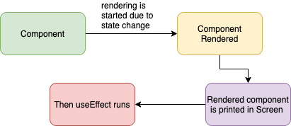
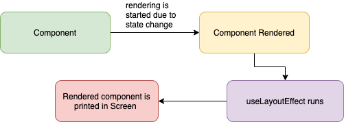

- Render : DOM Tree 를 구성하기 위해 각 엘리먼트의 스타일 속성을 계산하는 과정
- Paint : 실제 스크린에 Layout을 표시하고 업데이트하는 과정

## useEffect

- `useEffect`는 컴포넌트들이 render와 paint된 후 실행된다.
- 비동기적으로 실행된다.
- paint 된 후 실행되기 때문에, `useEffect` 내부에 dom에 영향을 주는 코드가 있을 경우 사용자 입장에서는 화면의 깜빡임을 보게 된다.

상태변화가 있으면 렌더링이 시작된다. 컴포넌트가 렌더되고 렌더된 컴포넌트가 스크린에 그려진다. 그다음 `useEffect`가 실행된다.

## useLayoutEffect

- `useLayoutEffect` 는 컴포넌트들이 render된 후 실행되며, 그 이후에 paint가 된다.
- 동기적으로 실행된다.
- paint가 되기전에 실행되기 때문에 dom을 조작하는 코드가 존재하더라도 사용자는 깜빡임을 경험하지 않는다.

상태변화가 있으면 렌더링이 시작된다. 컴포넌트가 렌더링되면 `useLayoutEffect`가 실행된다. 그리고 렌더된 컴포넌트가 스크린에 그려진다.

## 리액트 컴포넌트 렌더링

### 재렌더링 케이스

react 컴포넌트는 4가지 상황에서 재렌더링 된다.

1. 내부 상태값(state) 변경
2. 부모가 전해준 속성(props) 변경
3. 중앙 상태값(redux store 등) 변경
4. 부모 컴포넌트가 재렌더링되는 경우, 자식 컴포넌트도 재렌더링

컴포넌트가 렌더링되면, 해당 컴포넌트 함수가 호출되어 화면을 다시 그린다.

### React 마운트 과정

1. 함수 컴포넌트 호출
2. 구현부 실행
   - props 취득, hook 실행, 내부 변수 및 함수 생성
   - 단, hook에 등록해준 상태값, 부수 함수 효과 등은 별도 메모리에 저장되어 관리됨
3. return 실행
   - 렌더링 시작
4. 렌더 단계 (Render Phase)
   - 가상 DOM을 생성
5. 커밋 단계 (Commit Phase)
   - 실제 DOM에 반영한다.
6. useLayoutEffect
   - 브라우저가 화면에 페인트하기 전에, useLayoutEffect에 등록해둔 effect가 동기로 실행된다.
   - 이때 state, redux store 등의 변경이 있다면 한번 더 재렌더링된다.
7. Paint
   - 브라우저가 실제 DOM을 화면에 그린다. didMount가 완료된다.
8. useEffect
   - Mount되어 화면이 그려진 직후, useEffect에 등록해둔 effect가 비동기로 실행된다.

### React 재렌더링 과정

1. 함수 컴포넌트 재호출
2. 구현부 실행
   - props 취득, hook 실행, 내부 변수 및 함수 재생성
   - 단, 각 hook의 특성에 따라 기존에 메모리에 저장한 내용을 적절히 활용한다.
3. return 실행
   - 렌더링 시작
4. 렌더 단계 (Render Phase)
   - 새로운 가상 DOM생성 후, 이전 가상 DOM과 비교하여, 달라진 부분을 탐색하고, 실제 DOM에 반영할 부분을 결정한다.
5. 커밋 단계 (Commit Phase)
   - 달라진 부분만 실제 DOM에 반영한다.
6. useLayoutEffect
   - 브라우저가 화면에 Paint 하기 전에, useLayoutEffect에 등록해둔 effect가 동기로 실행된다.
   - 이때, state, redux store 등의 변경이 있다면 한번 더 재렌더링된다.
7. Paint
   - 브라우저가 실제 DOM을 화면에 그린다. didUpdate가 완료된다.
8. useEffect
   - update되어 화면이 그려진 직후, useEffect에 등록해둔 effect가 비동기로 실행된다.
   - effect에 return 부분이 있다면, 구현부보다 먼저 실행된다.

## 결론

`useLayoutEffect`는 동기적으로 실행되고 내부의 코드가 모두 실행된 후 painting 작업을 거친다. 따라서 로직이 복잡할 경우 사용자가 레이아웃을 보는데까지 시간이 오래걸린다는 단점이 있어서 기본적으로 항상 `useEffect`만을 사용하는 것을 권장한다.

 

## 참고

- [https://medium.com/@jnso5072/react-useeffect-와-uselayouteffect-의-차이는-무엇일까-e1a13adf1cd5](https://medium.com/@jnso5072/react-useeffect-%EC%99%80-uselayouteffect-%EC%9D%98-%EC%B0%A8%EC%9D%B4%EB%8A%94-%EB%AC%B4%EC%97%87%EC%9D%BC%EA%B9%8C-e1a13adf1cd5)
- [https://curryyou.tistory.com/486](https://curryyou.tistory.com/486)
