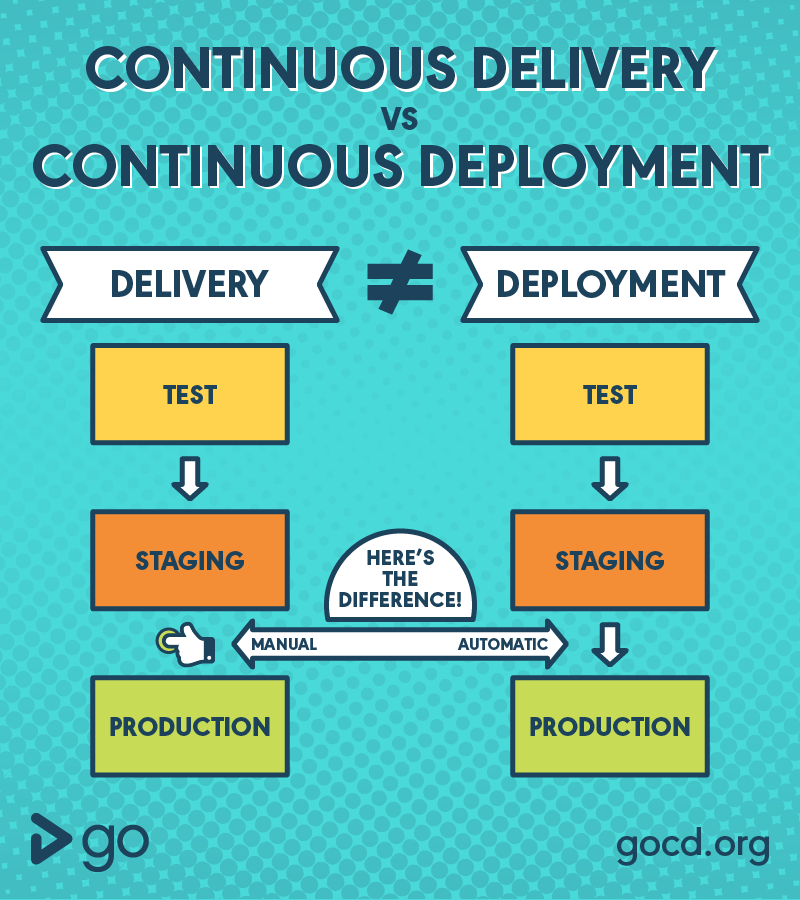

# CI와 CD

## CI/CD란?

- 개발부터 배포까지의 과정을 자동화하여 개발된 내용이 사용자에게 빠르게 도달할 수 있게 해주는 방법론

## CI (Continuous Integration)

- 지속적인 통합
- 어플리케이션에 새로운 코드 변경 사항이 정기적으로 빌드 및 테스트 되어 공유 레포지토리에 통합하는 것

### CI 장점

- 버그를 신속하게 찾아 해결
- 테스트 코드를 통과한 코드만이 레포지터리에 올라가기 때문에 소프트웨어 품질 개선, 향상
- 좋은 코드 퀄리티 유지
- 새로운 업데이트의 검증 및 릴리즈의 시간 단축, 개발 편의성 증가

## CD (Continuous Delivery/Deployment)

- 지속적인 제공 & 지속적인 배포 두 가지 모두를 뜻함
- 빌드의 결과물을 프로덕션으로 릴리스하는 작업을 자동화하는 것
- CD는 두가지로 구분할 수 있다.
  - 지속적 제공(Delivery), 지속적 배포(Deployment)
  - 둘의 차이점은 배포 작업의 자동화 여부이다.

### Continuous Delivery

- 지속적인 제공
- 공유 레포지토리로 자동으로 Release 하는 것, 배포 자체는 수동으로 실행한다.
- 바로 배포할 수 있는 코드베이스를 확보하는 것이 목적

### Continuous Deployment

- 지속적인 배포
- Continuous Delivery의 파이프라인 통과 + Production에 자동으로 배포한다.
- 어플리케이션의 제공 속도를 증가시킨다.

#### 차이점

- Continuous Delivery : 프로덕션 배포는 수동 (배포 과정은 자동화)
- Continuous Deployment : 프로덕션 배포까지 자동화
- 일반적으로 자동 배포까지의 과정을 통칭하지만, 어디까지 자동화가 이루어져 있는지를 설명하기 위해 별도로 구분함

#### CD 장점

- 개발자는 배포보다는 개발에 더욱 신경 쓸 수 있도록 도와준다.
- 개발자가 수작업 없이 빌드, 테스트, 배포까지의 자동화를 할 수 있다.
- 서비스의 사용자는 최대한 빠른 시간 내에 최신 버전의 Production을 제공받을 수 있다.

## 요약

1. CI는 빌드 및 테스트 후 코드를 지속적인 통합하는 것
2. Continuous Delivery는 CI를 통해 통합된 코드를 즉시 출시 가능한 상태로 준비해 놓는 것
3. Continuous Deployment는 CI를 통해 통합된 코드를 프로덕션에 즉시 배포하는 것
4. CI/CD는 팀마다 다르다.

## 참고

- https://www.redhat.com/ko/topics/devops/what-is-ci-cd
- https://www.youtube.com/watch?v=0Emq5FypiMM
